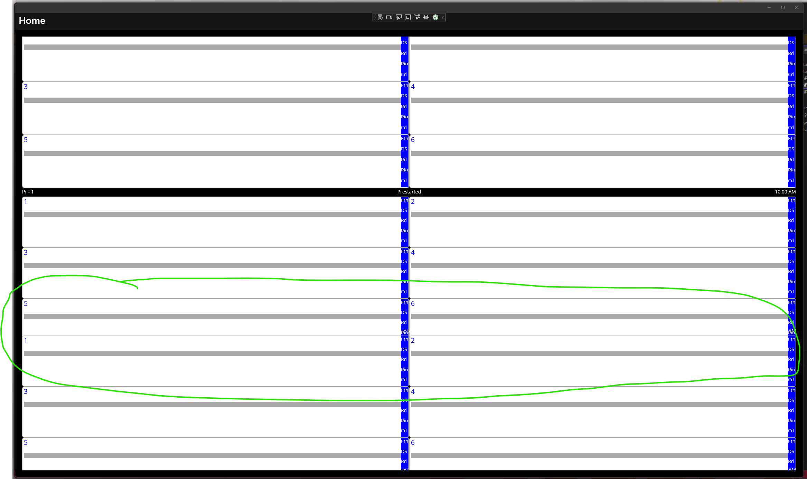

# MAUI Layouts bug

This repo is a demonstration of a few MAUI layout bugs.

## Bug 1 - Overlapping layouts.

The MainPage layout and subelements are overlapping, rather than being measured correctly. Individual collection items overlap, getting progressively worse as the page is scrolled. At the end of the page, the final rows are cut off entirely.

## Bug 2 - NullRef XAML Compiler

In the [`CardViewModelCollection`](Test/MainPage.xaml.cs), comment the `List<CardViewModel>` property and uncomment the `CardViewModel[]` property, and attempt to compile the repo. The XamlC compiler will null ref.